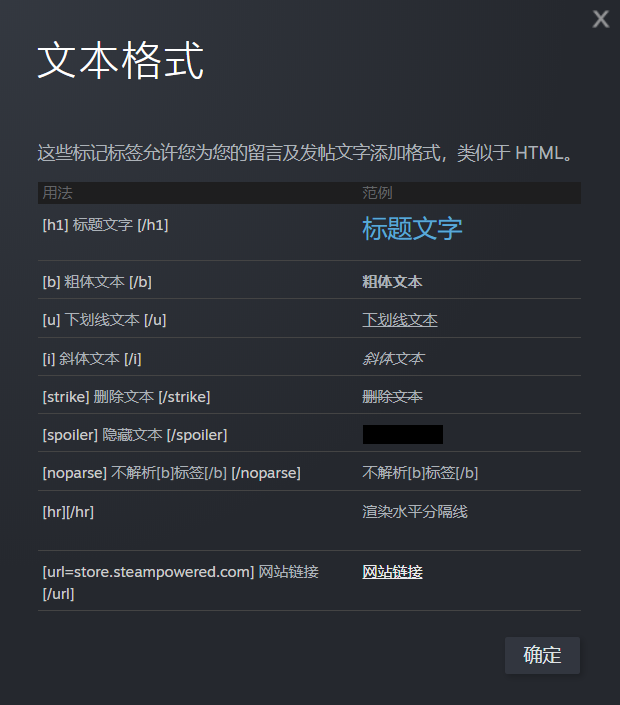

# 快速手册

### 常用Git命令


| 命令                        | 功能                       |
| ----------------------------- | ---------------------------- |
| git clone [url]             | 克隆拉取库                 |
| git pull                    | 拉取上游库当前分支         |
| git push                    | 推送本地库到上游           |
| git fetch                   | 与上游库同步，但不合并变更 |
| git checkout [branch]       | 切换分支                   |
| git checkout -b [branch]    | 新建分支并切换             |
| git remote add [name] [url] | 添加上游库                 |

### 常用调试命令


| 命令                          | 功能                                                                                           |
| ------------------------------- | ------------------------------------------------------------------------------------------------ |
| c_godmode()                   | 上帝模式/复活                                                                                  |
| c_supergodmode()              | 同c_godmode()，但会 额外加满三维                                                               |
| c_freecrafting()              | 解锁全部配方，合成不需材料                                                                     |
| c_reset()                     | 重载(客户端)/回到最近一次存档(服务器端)                                                        |
| c_regenerateworld()           | 重新生成世界                                                                                   |
| c_spawn(prefab,num)           | 在鼠标处生成num个prefab                                                                        |
| c_give(prefab,num)            | 给你num个某prefab                                                                              |
| c_despawn()                   | 重选人物                                                                                       |
| c_skip(num)                   | 跳过num天                                                                                      |
| c_removeall(prefab)           | 删除全部prefab                                                                                 |
| c_gonext(prefab)              | 传送到下一个prefab处                                                                           |
| c_armor()                     | 使你获得100%防御                                                                               |
| c_save()                      | 立即存档                                                                                       |
| c_select()                    | 选中当前鼠标下的实体以调试，返回值为实体的引用。在客户端调用时，可以在调试层查看实体的多种信息 |
| c_setmoisture(percent)        | 设置潮湿度                                                                                     |
| c_sethealth(percent)          | 设置血量                                                                                       |
| c_setsanity(percent)          | 设置理智                                                                                       |
| c_sethunger(percent)          | 设置饥饿度                                                                                     |
| c_setminhealth(num)           | 设置血量最低值（锁血）                                                                         |
| c_settemperature(num)         | 设置体温                                                                                       |
| c_connect(ip, port, password) | 手动连接服务器                                                                                 |

更多控制台命令在`consolecommands.lua`中

### 工坊页面特殊格式标记



### MOD基本文件夹结构


| 路径名                      | 内容                                                     |
| :---------------------------- | :--------------------------------------------------------- |
| ./images/                   | 一些零碎贴图                                             |
| ./images/inventoryimages/   | 物品栏贴图                                               |
| ./images/map_icons/         | 小地图图标                                               |
| ./images/colour_cubes/      | 滤镜                                                     |
| ./anim/                     | 编译后的动画文件                                         |
| ./export/                   | 未编译的动画文件                                         |
| ./scripts/                  | 所有脚本一般都放在这里                                   |
| ./scripts/brains/           | AI相关代码                                               |
| ./scripts/components/       | 自定义组件目录                                           |
| ./scripts/prefabs/          | 模组添加的全部物体，包括人物、物品、buff类               |
| ./scripts/stategraphs/      | 自定义的动作图                                           |
| ./scripts/widgets/          | 自定义窗体相关脚本                                       |
| ./modinfo.lua               | 游戏内模组介绍及模组配置都在这里                         |
| ./modmain.lua               | 模组代码入口                                             |
| ./modworldgenmain.lua       | 加载MOD时运行，优先级比modmain高，在这里可以修改世界生成 |
| ./modservercreationmain.lua | 暂时与modworldgenmain功能类似，但只会在服务器加载        |

### 常用官方函数与组件

- 全局函数


  | 函数名                     | 功能                                                                                                                            |
  | ---------------------------- | --------------------------------------------------------------------------------------------------------------------------------- |
  | SpawnPrefab                | 生成一个实体，返回对这个实体的引用                                                                                              |
  | AddStategraphState         | 添加动作图，自定义的stategraphs需要在modmain调用这个函数才会被加载                                                              |
  | modimport                  | 加载另一个lua文件并立即执行，文件内的return会立即结束加载，被加载的文件与当前文件共用环境                                       |
  | CreateEntity               | 添加一个实体，用于自定义prefab                                                                                                  |
  | MakeHauntableLaunch        | 让物品可以被“闹鬼”                                                                                                            |
  | AddMinimapAtlas            | 加载小地图图标，之后才可以在prefab中绑定                                                                                        |
  | GetModConfigData           | 读取mod配置页的设置，只可以在modmain或者modworldgenmain中调用                                                                   |
  | AddModCharacter            | 将一个实体声明为人物                                                                                                            |
  | AddReplicableComponent     | 声明一个组件为replica组件，带有_replica后缀的组件将在主客机同时存在，不带后缀的组件只会存在于主机，AddComponent只需要在主机调用 |
  | AddRecipe                  | 添加一个自定义制作配方                                                                                                          |
  | AddRecipeTab               | 添加一个自定义配方组                                                                                                            |
  | SetSharedLootTable         | 设置共用的掉落物品表                                                                                                            |
  | GetTime                    | 获取当前时间戳                                                                                                                  |
  | AddStategraphActionHandler | 将自定义动作图与动作绑定                                                                                                        |
  | AddComponentAction         | 添加自定义动作                                                                                                                  |
  | SpawnSaveRecord            | 加载一个实体，并将它设置为传入存档数据中的状态                                                                                  |
  | dumptable                  | 解码一个table并打印                                                                                                             |
  | UserToPlayer               | 将userid转为player实体                                                                                                          |
  | AddCookerRecipe            | 添加自定义食谱                                                                                                                  |

  此外，官方提供的大部分模组函数在```modutil.lua```文件中（上表不全部包含），数学拓展公式在```mathutil.lua```中，实体相关函数在```entityscript.lua```中，平滑过渡函数在```easing.lua```中，RPC类函数在`networkclientrpc.lua`中
- 常用组件，以下组件建议仔细阅读源码


  | 组件名        | 介绍       | 常用功能                                 |
  | --------------- | ------------ | ------------------------------------------ |
  | health        | 血量组件   | 掉血回血、死亡、生命上限惩罚、火焰伤害等 |
  | sanity        | 理智组件   |                                          |
  | hunger        | 饥饿组件   | 控制饥饿速度                             |
  | armor         | 护甲组件   | 护甲防御力，耐久，耐久耗尽是否破碎       |
  | weapon        | 武器组件   | 武器攻击力，攻击附带特效                 |
  | inventory     | 物品栏组件 |                                          |
  | inventoryitem | 物品组件   | 使实体可作为物品放入物品栏或箱子中       |
- <details><summary>其他组件</summary>
  <table><thead><tr><th><span>组件名</span></th><th><span>介绍</span></th><th><span>常用功能</span></th></tr></thead><tbody><tr><td><span>birdspawner</span></td><td><span>鸟类生成点</span></td><td><span>修改生成的鸟类类型、频率等</span></td></tr><tr><td><span>book</span></td><td><span>书籍组件</span></td><td><span>添加自定义书籍时可能会用</span></td></tr><tr><td><span>builder</span></td><td><span>建造组件</span></td><td><span>让玩家可以制作/建造物品，可以在这里修改来实现一键制造、重复制造等</span></td></tr><tr><td><span>burnable</span></td><td><span>可燃组件</span></td><td><span>设置物品燃烧时间，冒烟情况等</span></td></tr><tr><td><span>childspawner</span></td><td><span>巢穴组件</span></td><td><span>绑定到巢穴上来自动生成实体，如猪人、蜘蛛等，可以修改生成条件、生成速度、实体种类、巢穴被攻击时的某些特殊生成</span></td></tr><tr><td><span>colourcube</span></td><td><span>滤镜组件</span></td><td><span>自定义季节、时间、地上地下滤镜</span></td></tr><tr><td><span>combat</span></td><td><span>战斗组件</span></td><td><span>设置攻击伤害、攻击间隔、攻击距离、攻击buff、自动选择目标逻辑</span></td></tr><tr><td><span>container</span></td><td><span>容器组件</span></td><td><span>设置箱子格数，可放入物品判断，箱子内是否可堆叠，箱子是否可打开</span></td></tr><tr><td><span>cookable</span></td><td> </td><td><span>使一个实体可以在火堆上烹饪，可以设置烹饪产品和烹饪回调</span></td></tr><tr><td><span>cooldown</span></td><td><span>cd组件</span></td><td><span>设置某种操作的冷却时间，每个实体同时只可计算一种cd</span></td></tr><tr><td><span>debuff</span></td><td><span>buff组件</span></td><td><span>添加在buff上，SetAttachedFn设置buff被施加到实体时的回调，SetDetachedFn设置buff解除回调，SetExtendedFn设置buff未过期时被上了一个相同buff触发的回调</span></td></tr><tr><td><span>debuffable</span></td><td> </td><td><span>添加在实体上，使该实体可以附加buff并影响</span></td></tr><tr><td><span>deployable</span></td><td> </td><td><span>使实体可以被部署，如耕地机，可以设置部署地皮类型等</span></td></tr><tr><td><span>drawable</span></td><td><span>画板组件</span></td><td><span>使一个实体可以被"画"，如小木牌</span></td></tr><tr><td><span>drownable</span></td><td><span>溺水组件</span></td><td> </td></tr><tr><td><span>dynamicmusic</span></td><td><span>背景音乐组件</span></td><td><span>可以设置/修改不同季节，不同位置的环境背景音乐或与不同敌人作战时的音乐</span></td></tr><tr><td><span>eater</span></td><td> </td><td><span>使实体可以吃东西，可以设置能吃的食品类型，是否可以吃腐烂食物，吃东西时的回调，喜欢吃的食物种类</span></td></tr><tr><td><span>edible</span></td><td> </td><td><span>标记实体为可吃，可以设置食品三维，食品类型，对体温的影响效果，被吃时的回调</span></td></tr><tr><td><span>equippable</span></td><td> </td><td><span>使物品可装备，可设置装备槽，穿上/脱下的回调，装备额外移速，保温效果，防水效果、理智回复效果</span></td></tr><tr><td><span>finiteuses</span></td><td><span>耐久组件</span></td><td><span>设置物品总耐久，单次使用消耗耐久就</span></td></tr><tr><td><span>follower</span></td><td><span>跟随者</span></td><td><span>使生物可以跟随其他生物，可以设置单次跟随最大跟随时间，是否可以随领导者战斗</span></td></tr><tr><td><span>freezable</span></td><td> </td><td><span>设置冰冻抗性</span></td></tr><tr><td><span>fuel</span></td><td> </td><td><span>使物品成为燃料，可以设置燃料种类，燃烧值</span></td></tr><tr><td><span>fueled</span></td><td> </td><td><span>使实体可以燃烧燃料，可以设置燃烧速度，接受燃料的种类等</span></td></tr><tr><td><span>grogginess</span></td><td><span>困倦组件</span></td><td><span>实体被催眠时即与这个组件有关</span></td></tr><tr><td><span>growable</span></td><td><span>成长组件</span></td><td><span>主要用于树木生长，可以设置不同生长阶段的属性</span></td></tr><tr><td><span>harvestable</span></td><td> </td><td><span>主要用于可收获的建筑，如蜂箱、蘑菇农场，可设置收获产品类型，成熟时间</span></td></tr><tr><td><span>healer</span></td><td> </td><td><span>使物品可以用来“治疗”，可设置治疗量</span></td></tr><tr><td><span>healthtrigger</span></td><td> </td><td><span>添加到实体上，在实体生命值达到一定百分比时触发对应回调</span></td></tr><tr><td><span>leader</span></td><td> </td><td><span>与follower组件组合，实现领导——跟随</span></td></tr><tr><td><span>locomotor</span></td><td><span>移动组件</span></td><td><span>实体移动（非传送）均依赖于此组件，主要提供各种改变移速的方法</span></td></tr><tr><td><span>machine</span></td><td> </td><td><span>使实体可作为机器，主要提供启动/关闭操作</span></td></tr><tr><td><span>moisture</span></td><td><span>潮湿组件</span></td><td><span>与潮湿度相关</span></td></tr><tr><td><span>perishable</span></td><td> </td><td><span>食物腐烂相关</span></td></tr><tr><td><span>pickable</span></td><td> </td><td><span>可采摘的物品，如胡萝卜</span></td></tr><tr><td><span>plantable</span></td><td> </td><td><span>可种植的物品，如松果</span></td></tr><tr><td><span>playervision</span></td><td> </td><td><span>在这里替换玩家视野，夜视等，也可替换玩家滤镜</span></td></tr><tr><td><span>projectile</span></td><td><span>弹道组件</span></td><td><span>投掷品、发射物必需组件</span></td></tr><tr><td><span>reader</span></td><td> </td><td><span>使玩家可以读书</span></td></tr><tr><td><span>rechargeable</span></td><td><span>充能组件</span></td><td><span>主要用于装备cd等</span></td></tr><tr><td><span>repairable</span></td><td> </td><td><span>使物品可修理，设置接收修理工具类型</span></td></tr><tr><td><span>repairer</span></td><td> </td><td><span>使物品作为修理品，设置修理的目标属性</span></td></tr><tr><td><span>resistance</span></td><td> </td><td><span>免伤组件，骨甲的免伤就是用的这个</span></td></tr><tr><td><span>rider</span></td><td> </td><td><span>让玩家可以骑牛</span></td></tr><tr><td><span>sanityaura</span></td><td> </td><td><span>区域性的理智值buff，如格罗姆。可设置区域范围大小</span></td></tr><tr><td><span>scaler</span></td><td> </td><td><span>可随存档保存的放大缩小组件，默认只缩放提醒，通过OnApplyScale函数可自定义其他缩放</span></td></tr><tr><td><span>schoolspawner</span></td><td> </td><td><span>鱼群刷新组件</span></td></tr><tr><td><span>spawner</span></td><td> </td><td><span>这个是用来刷新boss类生物的，而不是猪人等</span></td></tr><tr><td><span>spellcaster</span></td><td><span>法术组件</span></td><td><span>使物品可以用来释放法术，如唤月法杖</span></td></tr><tr><td><span>stackable</span></td><td><span>堆叠组件</span></td><td> </td></tr><tr><td><span>talker</span></td><td><span>发言组件</span></td><td><span>实体说话时头上的那行小字，可以详细设置字号、字体、颜色等</span></td></tr><tr><td><span>timer</span></td><td><span>计时器组件</span></td><td><span>可以用来进行多个倒计时，每个计时结束时都会对附加的实体发送事件，具体计时情况会跟随存档，用途例如人物技能cd</span></td></tr><tr><td><span>tool</span></td><td><span>工具组件</span></td><td><span>用来给物品添加工具功能，例如砍、挖</span></td></tr><tr><td><span>tradable</span></td><td> </td><td><span>使物品可以用来换金子，具体换几个可以在设置</span></td></tr><tr><td><span>trader</span></td><td><span>商人组件</span></td><td><span>使实体可以与玩家交易，可设置具体交易内容</span></td></tr><tr><td><span>upgradeable</span></td><td><span>可升级组件</span></td><td><span>使物品可以用其他物品升级</span></td></tr><tr><td><span>useableitem</span></td><td> </td><td><span>是物品可以被“使用”，如灌木丛帽</span></td></tr><tr><td><span>waterproofer</span></td><td> </td><td><span>使装备具有防水效果</span></td></tr><tr><td><span>workable</span></td><td> </td><td><span>使物品可以被“砸”、“砍“等</span></td></tr><tr><td><span>writeable</span></td><td> </td><td><span>使物品可以被写，如木牌</span></td></tr></tbody></table>
  </details>
